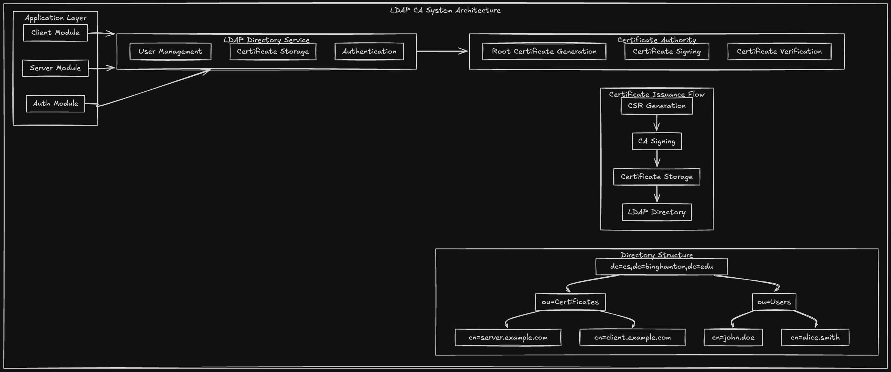

# Python LDAP & Certificate Authority System

A comprehensive implementation of an LDAP-like directory service with an integrated Certificate Authority (CA) for secure, certificate-based authentication.



---

## Features

- **Certificate Authority (CA)**: Self-signed root CA with CSR signing capabilities
- **LDAP-like Directory Service**: In-memory directory for users, certificates, and organizational data
- **Mutual TLS Authentication**: Both client and server verify each other's certificates
- **Encrypted Communication**: AES-256-CBC encryption for all messages after handshake

---

## Getting Started

### Prerequisites

- **Python 3.7+**
- The only external dependency is the `cryptography` library for RSA, AES, and X.509 operations

### Installation

1. Clone the repository or extract the project files:
   ```bash
   git clone https://github.com/mauliciousware/python_ldap.git
   cd python_ldap
   ```

2. Create a virtual environment (recommended):
   ```bash
   python -m venv .venv
   source .venv/bin/activate  # On Windows: .venv\Scripts\activate
   ```

3. Install the required Python packages:
   ```bash
   pip install -r requirements.txt
   ```

### Quick Verification

To verify that the system is working correctly, run the Alice-Bob demo:

```bash
python tests/demo_alice_bob_comm.py
```

You should see output showing:
- CA initialization
- User creation with automatic certificate issuance
- Mutual TLS handshake with certificate verification
- Encrypted message exchange with visible ciphertext

---

## System Architecture

The project is organized into five distinct modules:

```
python_ldap/
├── ca/                     # Certificate Authority
│   ├── certificate_authority.py   # Root CA, CSR signing
│   └── cert_manager.py            # CSR generation, format conversion
├── ldap/                   # Directory Service
│   ├── directory.py               # LDAP-like data store
│   └── user_manager.py            # User CRUD with auto certificate issuance
├── auth/                   # Authentication & Authorization
│   ├── roles.py                   # OA, DA, RegularUser roles
│   ├── permissions.py             # Permission definitions
│   └── secure_communication.py    # TLS handshake, encryption
├── server/                 # Server Components
│   ├── ldap_server.py             # Directory operations server
│   └── secure_server.py           # mTLS server implementation
├── client/                 # Client Components
│   ├── ldap_client.py             # Directory operations client
│   └── secure_client.py           # mTLS client implementation
└── tests/                  # Demo & Test Files
    └── demo_alice_bob_comm.py     # Full workflow demonstration
```

### Module Relationships

```
┌─────────────────────────────────────────────────────────────────────┐
│                         Application Layer                           │
│  ┌─────────────┐    ┌─────────────┐    ┌─────────────┐             │
│  │   Client    │    │   Server    │    │    Auth     │             │
│  │   Module    │    │   Module    │    │   Module    │             │
│  └──────┬──────┘    └──────┬──────┘    └──────┬──────┘             │
└─────────┼──────────────────┼──────────────────┼─────────────────────┘
          │                  │                  │
          ▼                  ▼                  ▼
┌─────────────────────────────────────────────────────────────────────┐
│                      LDAP Directory Service                          │
│  ┌────────────────┐  ┌──────────────────┐  ┌────────────────┐      │
│  │ User Management│  │Certificate Storage│  │ Authentication │      │
│  └────────────────┘  └──────────────────┘  └────────────────┘      │
└─────────────────────────────────────────────────────────────────────┘
          │                  │                  │
          ▼                  ▼                  ▼
┌─────────────────────────────────────────────────────────────────────┐
│                      Certificate Authority                           │
│  ┌────────────────┐  ┌──────────────────┐  ┌────────────────┐      │
│  │ Root CA Cert   │  │  CSR Signing     │  │ Cert Verify    │      │
│  └────────────────┘  └──────────────────┘  └────────────────┘      │
└─────────────────────────────────────────────────────────────────────┘
```

---

### The TLS Handshake Process

The TLS handshake establishes a secure connection before any application data is exchanged:

```
┌─────────────┐                                    ┌─────────────┐
│   Client    │                                    │   Server    │
└──────┬──────┘                                    └──────┬──────┘
       │                                                  │
       │  ──────────── ClientHello ──────────────────►   │
       │  (Supported cipher suites, random number)        │
       │                                                  │
       │  ◄─────────── ServerHello ───────────────────   │
       │  (Selected cipher suite, random number)          │
       │                                                  │
       │  ◄─────────── Certificate ───────────────────   │
       │  (Server's X.509 certificate)                    │
       │                                                  │
       │  ◄─────────── ServerHelloDone ───────────────   │
       │                                                  │
       │  ──────────── ClientKeyExchange ─────────────►  │
       │  (Pre-master secret encrypted with server's     │
       │   public key)                                    │
       │                                                  │
       │  ──────────── ChangeCipherSpec ──────────────►  │
       │  ──────────── Finished ──────────────────────►  │
       │                                                  │
       │  ◄─────────── ChangeCipherSpec ───────────────  │
       │  ◄─────────── Finished ───────────────────────  │
       │                                                  │
       │  ═══════════ Encrypted Data ═══════════════════ │
       │                                                  │
```

### Mutual TLS (mTLS)

Standard TLS only authenticates the server to the client. **Mutual TLS (mTLS)** adds client authentication:

```
┌─────────────┐                                    ┌─────────────┐
│   Client    │                                    │   Server    │
│ (has cert)  │                                    │ (has cert)  │
└──────┬──────┘                                    └──────┬──────┘
       │                                                  │
       │  ──────────── ClientHello ──────────────────►   │
       │  + Client Certificate                            │
       │                                                  │
       │         ┌──────────────────────────────┐        │
       │         │ Server verifies client cert  │        │
       │         │ against trusted CA           │        │
       │         └──────────────────────────────┘        │
       │                                                  │
       │  ◄─────────── ServerHello ───────────────────   │
       │  + Server Certificate                            │
       │  + Encrypted Session Key                         │
       │                                                  │
       │         ┌──────────────────────────────┐        │
       │         │ Client verifies server cert  │        │
       │         │ against trusted CA           │        │
       │         └──────────────────────────────┘        │
       │                                                  │
       │  ═══════════ Secure Channel Established ═══════ │
       │                                                  │
```

### How Our System Implements mTLS

Our implementation follows this flow:

#### 1. User Creation with Certificate Issuance

```python
from ldap.user_manager import UserManager

# UserManager automatically issues certificates via CA
user_manager = UserManager(directory, ca=ca)
dn, cert_info = user_manager.create_user(
    username="alice",
    email="alice@example.com",
    password="secure_password",
    issue_certificate=True  # Certificate issued during creation
)
# cert_info contains: {"cert_pem": "...", "private_key_pem": "..."}
```

#### 2. Mutual Handshake

```python
from client.secure_client import SecureClient
from server.secure_server import SecureServer

# Client initiates with their certificate
client = SecureClient(
    ca_cert_pem=ca_cert,
    client_cert_pem=alice_cert,
    client_key_pem=alice_key
)
request = client.initiate_mutual_handshake()
# request = {"type": "mutual_handshake", "client_certificate": "..."}

# Server verifies client, creates session key
response = server.handle_client_request(request)
# Server checks: Is client cert signed by our CA? ✓

# Client verifies server, decrypts session key
result = client.complete_mutual_handshake(response)
# Client checks: Is server cert signed by our CA? ✓
```

#### 3. Encrypted Communication

```python
# All messages are now encrypted with the shared session key
encrypted_request = client.send_encrypted_message("Hello, secure world!")
response = server.handle_client_request(encrypted_request)
decrypted = client.receive_encrypted_message(response)
```

### Preventing Man-in-the-Middle Attacks

A **Man-in-the-Middle (MITM)** attack occurs when an attacker intercepts communication between two parties:

```
WITHOUT mTLS:
┌────────┐         ┌──────────┐         ┌────────┐
│ Client │ ◄─────► │ Attacker │ ◄─────► │ Server │
└────────┘         └──────────┘         └────────┘
    │                   │                   │
    │   Client thinks   │   Server thinks   │
    │   they're talking │   they're talking │
    │   to server       │   to client       │
```

**How mTLS prevents MITM:**

1. **Certificate Verification**: Both parties verify certificates against the trusted CA
2. **Private Key Proof**: Only the legitimate owner can decrypt messages encrypted with their public key
3. **Session Key Protection**: The session key is encrypted with the verified party's public key

```
WITH mTLS:
┌────────┐         ┌──────────┐         ┌────────┐
│ Client │         │ Attacker │         │ Server │
└────────┘         └──────────┘         └────────┘
    │                   │                   │
    │   Attacker's      │                   │
    │   certificate     │                   │
    │   NOT signed by   │                   │
    │   trusted CA!     │                   │
    │                   │                   │
    ╳ CONNECTION REJECTED ╳                 │
```

---